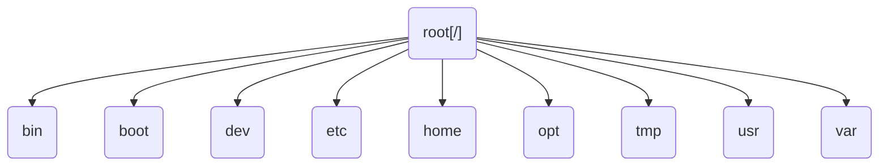

# Linux-Betriebssystem


---

## 1. Einstieg: Was ist Linux?

Linux ist ein **freies und quelloffenes Betriebssystem**.

Genauer gesagt ist Linux der **Kernel eines Betriebssystems**.

Im Alltag meint man mit „Linux“ meistens ein vollständiges Betriebssystem, also eine **Linux-Distribution**.

!!! note "Merksatz"
    Linux ist genau genommen der Kernel.
    Eine vollständige nutzbare Linux-Version nennt man Distribution.

### Bestandteile einer Linux-Distribution

Eine Linux-Distribution besteht zum Beispiel aus:
- Linux-Kernel
- Systemprogrammen
- Paketmanager
- Benutzerverwaltung
- Dateisystem
- Terminal
- grafischer Oberfläche
- Standardprogrammen

---

## 2. Was ist ein Betriebssystem?

Ein Betriebssystem ist die **Grundsoftware eines Computers**.

Es sorgt dafür, dass Programme mit der Hardware arbeiten können.

Das Betriebssystem verwaltet zum Beispiel:
- Prozessor
- Arbeitsspeicher
- Festplatten
- Dateien
- Programme
- Benutzerkonten
- Netzwerkverbindungen
- Rechte und Sicherheit

!!! example "Einfach erklärt"
    Das Betriebssystem ist die Vermittlung zwischen Mensch, Programmen und Hardware.

    ```mermaid
    ---
    config:
    look: handDrawn
    ---
    flowchart LR
    A(Benutzer) --> B(Programme)
    B --> C(Betriebssystem)
    C --> D(Hardware)
    ```

    

---

## 3. Der Linux-Kernel

Der Kernel ist der **zentrale Kern eines Betriebssystems**.

Er vermittelt zwischen Software und Hardware.

Der Kernel kümmert sich unter anderem um:
- Prozesse
- Speicherverwaltung
- Gerätetreiber
- Dateisysteme
- Netzwerkfunktionen
- Rechteverwaltung
- Kommunikation mit Hardware


!!! example "Beispiel"
    Wenn ein Programm eine Datei speichern möchte, spricht es nicht direkt mit der Festplatte.
    Der Vorgang läuft über Betriebssystem und Kernel.

    ```mermaid
    ---
    config:
    look: handDrawn
    ---
    flowchart LR
    A(Programm) --> B(Betriebssystem)
    B --> C(Kernel)
    C --> D(Hardware)
    ```


## 4. Linux-Kernel und Linux-Distribution

### Definitionen

| Begriff            | Bedeutung                               |
|--------------------|----------------------------------------|
| Linux-Kernel       | Technischer Kern des Betriebssystems    |
| Linux-Distribution | Vollständiges Betriebssystem auf Basis des Linux-Kernels |
| Paketmanager       | Werkzeug zum Installieren, Aktualisieren und Entfernen von Software |
| Desktop-Umgebung   | Grafische Oberfläche eines Linux-Systems |
| Shell              | Programm, das Terminalbefehle verarbeitet |

!!! warning "Wichtig"
    Viele sagen einfach „Linux“, meinen aber eigentlich eine Linux-Distribution wie Ubuntu, Debian oder Linux Mint.


## 5. Einführung in Linux-Distributionen

Eine **Linux-Distribution** ist eine Sammlung von Softwareprogrammen, die auf dem Linux-Kernel basiert.

### Hauptbestandteile
- Linux-Kernel
- Systemdienste
- Paketmanager
- Terminal und Shell
- Grafische Oberfläche
- Standardprogramme
- Update-System
- Sicherheitskonfigurationen

---

## 6. Bekannte Linux-Distributionen

### Übersicht

| Distribution              | Typischer Einsatz                                     | Besonderheiten                                                                 |
|--------------------------|------------------------------------------------------|-------------------------------------------------------------------------------|
| **Ubuntu**               | Einsteiger, Desktop, Server, Entwicklung           | Größte Nutzerbasis, gute Dokumentation, Ubuntu Server für professionelle Anwendungen |
| **Debian**               | Server, stabile Systeme, Grundlage anderer Distros   | Stabil, langsame Releases, Community-orientiert                               |
| **Linux Mint**           | Desktop, Windows-Umsteiger                           | Ähnlich Windows, Ubuntu-basiert, sehr benutzerfreundlich                      |
| **Fedora**               | Moderne Technologien, Entwickler                    | Vorabversionen von RHEL, cutting-edge Technologie                             |
| **Arch Linux**           | Fortgeschrittene Nutzer                              | Minimaler Basiskernel, Rolling Release,高度 anpassbar                         |
| **openSUSE**             | Desktop, Server, Unternehmen                        | Starker Desktop, KDE Voreinstellung, gute Containerunterstützung              |
| **Kali Linux**           | IT-Sicherheit und Penetration Testing               | Specialized für Cybersecurity, viele Pen-Testing Tools                       |
| **Raspberry Pi OS**      | Raspberry Pi, Bildung, Bastelprojekte               | Optimiert für ARM, leichtgewichtig, excellent für Education                   |
| **Red Hat Enterprise Linux** | Unternehmen und professionelle Server            | Enterprise-Grade, Support, SLA, teuer für Unternehmen                        |

---

## 7. Gründe für Vielfalt

### Linux ist Open Source

> „Der Quellcode ist offen und kann von anderen genutzt, verändert und weiterentwickelt werden“

### Unterschiede zwischen Distributionen

| Aspekt                   | Einfluss auf Wahl                                     |
|--------------------------|------------------------------------------------------|
| **Zielgruppe**           | Desktop vs. Server vs. Embedded                      |
| **Paketmanager**         | apt vs. yum vs. pacman vs. dnf                        |
| **Update-Modell**        | Rolling Release vs. Major Releases                    |
| **Stabilität**           | Bleeding Edge vs. Stabil vs. LTS                      |
| **grafische Oberfläche** | GNOME vs. KDE Plasma vs. XFCE vs. LXQt               |
| **vorinstallierte Software** | Desktop-Umgebung mit Software vs. Minimal Install |
| **Support**              | Community vs. Enterprise vs. Commercial                |
| **Sicherheitskonzept**   | hardened Defaults vs. Standard Approach               |

---

## 8. Erfassung nach Nutzergruppen

### Einsteiger

**Erfasste Distributionen:**
- Ubuntu
- Linux Mint
- Zorin OS
- Pop!_OS
- elementary OS

**Merkmale:**
- Einfache Installation
- Graphische Benutzeroberfläche als Hauptzugang
- Große Apps-Vorratsmenge
- Gute Community-Unterstützung
- Hohe Benutzerfreundlichkeit

### Server

**Erfasste Distributionen:**
- Debian
- Ubuntu Server
- AlmaLinux
- Rocky Linux
- Red Hat Enterprise Linux
- CentOS Stream

**Servermerkmale:**
- Optimiertes Kernel-Modell
- Robustes Paketmanagement
- Entwicklungsorientierte Tools
- Langfristige Unterstützung (LTS)
- Optimierter Sicherheitsfokus
- Kompatibilität mit Enterprise-Anwendungen

### Fortgeschrittene

**Erfasste Distributionen:**
- Arch Linux
- Gentoo
- openSUSE Tumbleweed
- Void Linux
- Slackware

**Fortgeschritteneneigenschaften:**
- Minimaler Basiskernel
- Vollständige Systemkontrolle
- Customizability und Flexibilität
- Advanced Paketmanagement
- Low-Level-Access
- Command-Line-Zentriert

### IT-Sicherheit

**Erfasste Distributionen:**
- Kali Linux
- Parrot OS
- BlackArch
- Samurai Web Framework
- Security Onion

**Sicherheitsmerkmale:**
- Spezialisierte Tools für Penetration Testing
- hardened Systemkonfigurationen
- Vorabkonfigurierte Forensik-Umgebungen
- Spezielle Netzwerk-Tools
- MFA-Unterstützung
- Security-Focused Pkgs


## 7. Typische Einsatzbereiche von Linux

Linux wird in sehr vielen Bereichen eingesetzt.

### Übersicht

| Bereich             | Beispiel                                       |
|--------------------|-----------------------------------------------|
| Server              | Webserver, Datenbankserver, Mailserver         |
| Cloud               | AWS, Azure, Google Cloud                      |
| Entwicklung       | Webentwicklung, Backend, DevOps                |
| Container           | Docker, Kubernetes                             |
| Mobilgeräte         | Android nutzt den Linux-Kernel                |
| Netzwerkgeräte      | Router, Firewalls                             |
| Embedded Systems    | Smart-TVs, IoT-Geräte, Industrieanlagen       |
| Bildung             | Raspberry Pi                                  |
| Supercomputer       | Hochleistungsrechner                          |

!!! success "Praxisbezug"
    Viele Webseiten, Apps und Cloud-Dienste laufen im Hintergrund auf Linux-Systemen.

---

## 8. Vorteile und Nachteile von Linux

### Vorteile

Linux bietet viele Vorteile:

- kostenlos nutzbar
- Open Source
- stabil
- flexibel anpassbar
- gut für Server geeignet
- starke Rechteverwaltung
- viele Entwicklerwerkzeuge
- große Community
- große Auswahl an Distributionen
- läuft auch auf älterer Hardware
- gut automatisierbar

### Nachteile

Linux hat auch Nachteile:

- manche Programme gibt es nicht nativ für Linux
- einige Spiele funktionieren schlechter als unter Windows
- bestimmte Hardware benötigt zusätzliche Treiber
- die Kommandozeile wirkt am Anfang ungewohnt
- nicht jede Distribution ist einsteigerfreundlich
- bei Problemen muss man häufiger selbst recherchieren

!!! warning "Realistisch bleiben"
    Linux ist sehr mächtig, aber nicht automatisch für jeden Zweck die beste Wahl.

---

## 9. Die grafische Oberfläche

Linux kann mit grafischer Oberfläche oder nur über die Kommandozeile verwendet werden.

### Bekannte Desktop-Umgebungen

| Desktop-Umgebung   | Eigenschaft                                       |
|--------------------|--------------------------------------------------|
| GNOME              | modern, schlicht, reduziert                       |
| KDE Plasma          | sehr anpassbar                                   |
| XFCE                | leichtgewichtig, gut für ältere Rechner          |
| Cinnamon            | klassisch, Windows-ähnlich                        |
| MATE                | schlicht und ressourcenschonend                   |
| LXQt                | sehr leichtgewichtig                             |

!!! note "Hinweis"
    Die grafische Oberfläche ist nicht „Linux selbst“, sondern nur ein Teil der Distribution.

⸻

## 10. Terminal und Shell

### Einführung in Terminal und Shell

Das **Terminal** ist ein Programm, mit dem man Befehle eingeben kann.

Die **Shell** nimmt diese Befehle entgegen und führt sie aus.

!!! note "Merksatz"
    Das Terminal ist das Fenster.
    Die Shell ist das Programm, das die Befehle verarbeitet.

### Bekannte Shells

| Shell | Beschreibung |
|-------|--------------|
| Bash  | sehr verbreitet |
| Zsh   | moderne Shell mit vielen Komfortfunktionen |
| Fish  | benutzerfreundliche Shell |

Die bekannteste Shell unter Linux ist **Bash**.

---

## 11. Erste wichtige Linux-Befehle

### Übersicht

| Befehl       | Bedeutung                               |
|--------------|----------------------------------------|
| `pwd`        | zeigt den aktuellen Ordner an           |
| `ls`         | zeigt Dateien und Ordner an             |
| `cd`         | wechselt den Ordner                     |
| `mkdir`      | erstellt einen Ordner                   |
| `touch`      | erstellt eine leere Datei               |
| `cat`        | zeigt den Inhalt einer Datei an         |
| `cp`         | kopiert Dateien oder Ordner             |
| `mv`         | verschiebt oder benennt um              |
| `rm`         | löscht Dateien                          |
| `clear`      | leert die Terminalansicht               |
| `whoami`     | zeigt den aktuellen Benutzer an         |
| `sudo`       | führt einen Befehl mit Administratorrechten aus |

---

## 12. Erste Befehle ausprobieren

### Praxisaufgabe

Öffne ein Terminal und führe die folgenden Befehle Schritt für Schritt aus:

```bash
pwd
ls
mkdir linux-uebung
cd linux-uebung
touch info.txt
echo "Mein erstes Linux-Dokument" > info.txt
cat info.txt
ls -l
```

⸻

## 13. Das Linux-Dateisystem

Linux organisiert Dateien in einer Baumstruktur.

Der oberste Punkt heißt Root-Verzeichnis und wird mit / dargestellt.




!!! note "Merksatz"
    Unter Linux beginnt das Dateisystem bei "/" .

    


## Übersicht der wichtigsten Verzeichnisse

| Verzeichnis | Bedeutung |
|-------------|-----------|
| `/`         | Wurzel des Dateisystems |
| `/home`     | persönliche Benutzerordner |
| `/root`     | Home-Verzeichnis des Administrators |
| `/etc`      | Konfigurationsdateien |
| `/var`      | veränderliche Daten, Logs, Caches |
| `/tmp`      | temporäre Dateien |
| `/usr`      | Programme und Bibliotheken |
| `/bin`      | wichtige ausführbare Programme |
| `/sbin`     | Systemprogramme |
| `/boot`     | Dateien für den Systemstart |
| `/dev`      | Gerätedateien |
| `/opt`      | optionale Zusatzsoftware |

⸻

15. Verzeichnisse untersuchen

!!! task “Praxisaufgabe”
Sieh dir wichtige Linux-Verzeichnisse an.
```
ls /
ls /home
ls /etc
ls /var
```

## “Kontrollfragen”
Was befindet sich im Root-Verzeichnis /?
??? success "Antwort" 
    Systemdateien und wichtige Verzeichnisse wie /bin, /etc, /home, etc.

Wo liegen Benutzerordner?
??? success "Antwort" 
    Im Verzeichnis `/home`

Wo liegen viele Konfigurationsdateien?
??? success "Antwort"
    Im Verzeichnis `/etc`

Wo liegen Logs und veränderliche Daten?
??? success "Antwort"
    Im Verzeichnis `/var`


⸻

## 16. Benutzer und Rechte

Linux ist ein **Mehrben Benutzersystem**. Das bedeutet, dass die Sicherheit und die Trennung von Daten im Vordergrund stehen.

### Kernkonzepte
- **Multi-User-Unterstützung**: Mehrere Benutzer können gleichzeitig auf einem System existieren.
- **Datentrennung**: Jeder Benutzer hat seine eigenen, privaten Dateien.
- **Zugriffskontrolle**: Rechte steuern präzise, wer Dateien lesen, schreiben oder Programme ausführen darf.
- **Schutz der Administration**: Administratorrechte sind besonders geschützt, um das System vor unbefugten Änderungen zu bewahren.

### Wichtige Begriffe

| Begriff | Bedeutung |
| :--- | :--- |
| **Benutzer** | Ein normales Nutzerkonto für den täglichen Gebrauch. |
| **Gruppe** | Eine Zusammenfassung mehrerer Benutzer (um Rechte gemeinsam zu verwalten). |
| **root** | Der Administrator mit vollständigen, uneingeschränten Rechten. |
| **sudo** | Ein Befehl, um einzelne Aufgaben mit erhöhten Rechten auszuführen. |
| **Rechte** | Die Berechtigungen: Lesen, Schreiben oder Ausführen. |

---

## 17. Linux-Rechte

In Linux haben **alle** Dateien und Ordner spezifische Berechtigungen. Diese bestimmen, welche Aktionen ein Benutzer durchführen darf.

### Die drei Grundrechte

| Recht | Kürzel | Bedeutung |
| :--- | :---: | :--- |
| **read** | `r` | Dateien lesen oder Inhalt von Ordnern anzeigen. |
| **write** | `w` | Dateien verändern oder neue Dateien in Ordnern erstellen. |
| **execute** | `x` | Programme oder Skripte ausführen bzw. Ordner betreten. |

